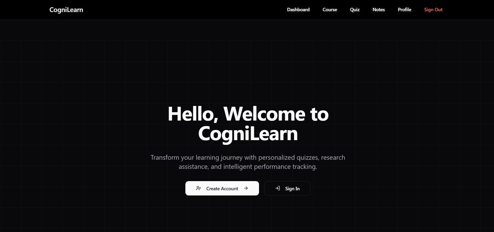
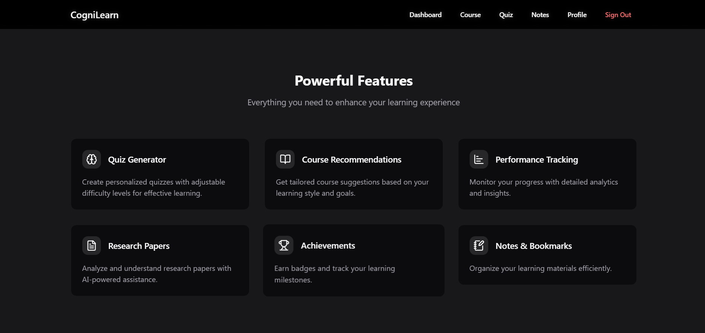
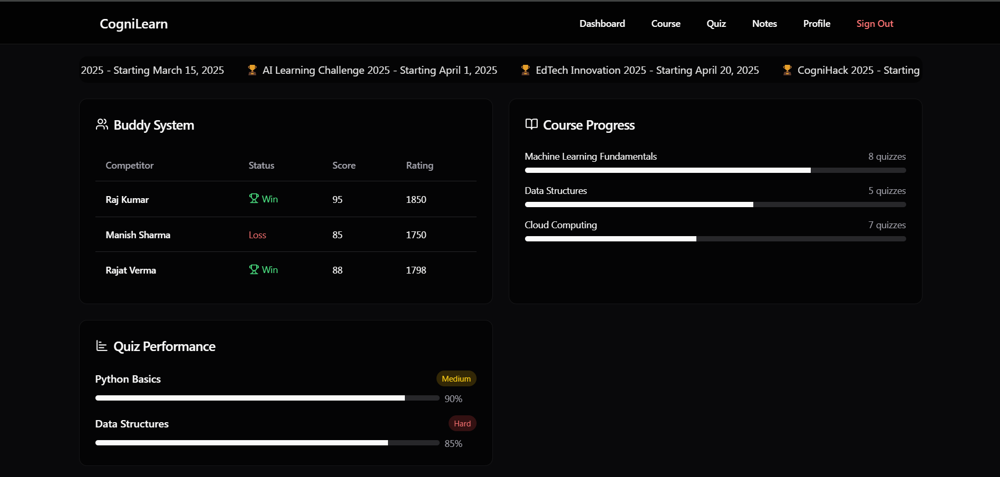

<h1 align="center">🚀 CogniLearn - Adaptive Learning Platform</h1>

    

    <strong>CogniLearn</strong> is an <strong>AI-powered adaptive learning platform</strong> that personalizes education through  
    intelligent recommendations, quizzes, research analysis, and performance insights.

<h2>🎥 Live Demonstration</h2>

Watch the full demo on YouTube:

    <a href="https://www.youtube.com/watch?v=g95UoafGhlw" alt="YouTube">📹 Watch Now</a>

<h2>🌟 Key Features</h2>
<ul>
    <li>✅ <strong>Course Recommendation System</strong> – AI-driven personalized course suggestions.</li>
    <li>✅ <strong>Quiz Generator</strong> – Dynamic quizzes based on difficulty and topic selection.</li>
    <li>✅ <strong>Research Paper Analyzer</strong> – Extracts key insights from research papers.</li>
    <li>✅ <strong>Performance Analysis Dashboard</strong> – Tracks learning progress and achievements.</li>
    <li>✅ <strong>Profile Management</strong> – Detailed user profiles with course history and badges.</li>
    <li>✅ <strong>Engaging UI</strong> – Intuitive and visually appealing interface for seamless learning.</li>
</ul>

    
Features

    
    
Dashboard

    

<h2>🔧 Tech Stack Used</h2>

<h3>🖥️ Frontend</h3>
<ul>
    <li>🚀 <strong>React.js (Next.js)</strong> – Fast and optimized UI.</li>
    <li>🎨 <strong>Tailwind CSS</strong> – Modern and responsive design.</li>
    <li>🛠️ <strong>ShadCN & Lucide Icons</strong> – Elegant UI components.</li>
    <li>🔗 <strong>Axios</strong> – Handles API requests efficiently.</li>
</ul>

<h3>⚙️ Backend</h3>
<ul>
    <li>🧠 <strong>Python (FastAPI)</strong> – AI/ML integration for quizzes and recommendations.</li>
</ul>

<h3>🗄️ Database</h3>
<ul>
    <li>📦 <strong>Supabase</strong> – PostgreSQL-based cloud database with authentication and real-time capabilities.</li>
</ul>

<h2>🚀 How to Run the Project</h2>

<h3>1️⃣ Clone the Repository</h3>
<pre><code>git clone https://github.com/sohamyedgaonkar/Team_MindMesh_AmdocsGenAI.git
cd Team_MindMesh_AmdocsGenAI
</code></pre>

<h3>2️⃣ Install Dependencies</h3>

<h4>Frontend</h4>
<pre><code>cd Frontend
npm i
npm run dev
</code></pre>

<h2>🏆 Why Choose CogniLearn?</h2>
<ul>
    <li>✅ <strong>Personalized Learning</strong> – AI adapts to user needs.</li>
    <li>✅ <strong>Full-Stack & Scalable</strong> – Built with modern web technologies.</li>
    <li>✅ <strong>Performance-Focused</strong> – Optimized for speed and efficiency.</li>
    <li>✅ <strong>Cloud-Ready</strong> – Easily deployable using cloud infrastructure.</li>
</ul>

<h2>📌 Future Enhancements</h2>
<ul>
    <li>🏅 <strong>Gamification Features</strong> – Achievements, badges, and leaderboards.</li>
</ul>

<h2>🤝 Contributors</h2>
<ul>
    <li>👤 <strong>Soham Yedgaonkar</strong></li>
    <li>👤 <strong>Sameer Dhande</strong></li>
</ul>

